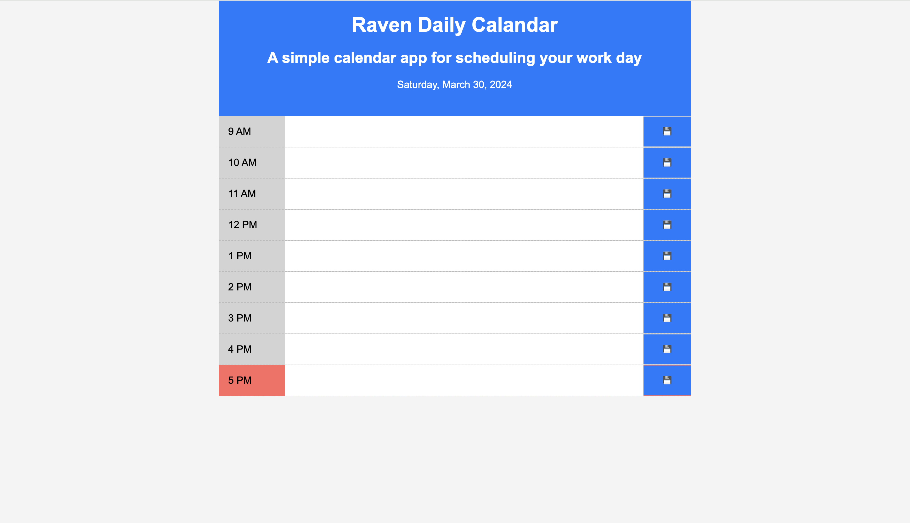

# Raven-Daily-Calendar

A simple, intuitive, and interactive calendar application for scheduling your workday from 9 AM to 5 PM. Utilizing the power of jQuery and the Day.js library, this app allows you to add and save important events to each hour of your typical workday, helping you to manage your time effectively.

## Features

- Current day is displayed at the top of the calendar
- Timeblocks for standard business hours (9 AM - 5 PM)
- Timeblocks are color-coded to indicate whether the time slot is in the past, present, or future
- Clickable timeblocks for adding events
- Persistent event storage through local storage

## Technologies

- HTML
- CSS
- Java Script (jQuery & Day.js lirary)

## Preview

## Usage

To use the application, simply click on a time block to add an event and press the save button to store the event. Your events will be saved to the browser's local storage and will persist even after the browser or tab is closed.

## Installation

To get started, clone this repository to your local machine:

## Live Site
[Visit the live site][live-site]

[live-site]: https://piattie.github.io/Raven-Daily-Calendar/
